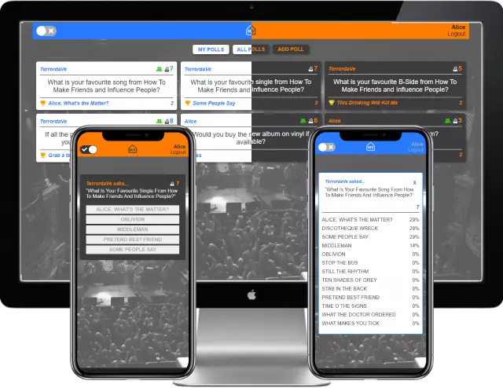

Project Link: [TV Fan Poll](https://illustrious-travesseiro-d45285.netlify.app/)

# TerrorVision Fan Poll

<!-- A little info about your project and/ or overview that explains **what** the project is about. -->

An app for fans to create and answer polls for anything terrorvision related.

## Game Details

Each player choses ten numbers (from available lotto numbers range). Mark off each of your numbers if the ball was drawn in the official lotto draw. The winner is the first person to match all ten numbers.

## Motivation

I wanted to learn the MERN stack so I decided to build out another Terrorvision app . Ultimately helping me closer to my goal of building out full stack applications.

## Code

I used the MERN stack for this. Although I had coded in React and Express with Mongo, I had not yet used them together for a full MERN stack app.

<!-- If you're using any code style like xo, standard etc. That will help others while contributing to your project. Ex. - -->
<!--  -->

<!-- ## Screenshots -->

<!-- Include logo/demo screenshot etc. -->

<!--  -->

<!-- ## Tech/framework used

Ex. -

<b>Built with</b>

- [Electron](https://electron.atom.io) -->

<!-- ## Features

What makes your project stand out? -->

## Future Features

- User Statistics
- Progressive Web App
- Share polls to social media or whatsapp

<!-- ## Code Example

Show what the library does as concisely as possible, developers should be able to figure out **how** your project solves their problem by looking at the code example. Make sure the API you are showing off is obvious, and that your code is short and concise. -->

<!-- ## Installation

Provide step by step series of examples and explanations about how to get a development env running. -->

<!-- ## API Reference

Depending on the size of the project, if it is small and simple enough the reference docs can be added to the README. For medium size to larger projects it is important to at least provide a link to where the API reference docs live.

## Tests

Describe and show how to run the tests with code examples. -->

<!-- ## How to use? -->

## Contact

If you want to contact me you can reach me at [daveperry.tech](https://daveperry.tech)

<!-- [loopy lotto repo](https://github.com/your_username/repo_name) -->

## License

<!-- A short snippet describing the license (MIT, Apache etc) -->

Distributed under the MIT License. See [LICENSE.txt](LICENSE.txt) for more information.

<!-- MIT © [Dave Perry]() -->
